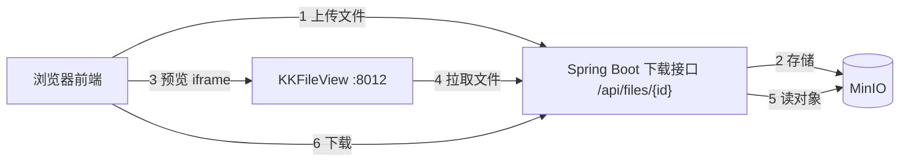
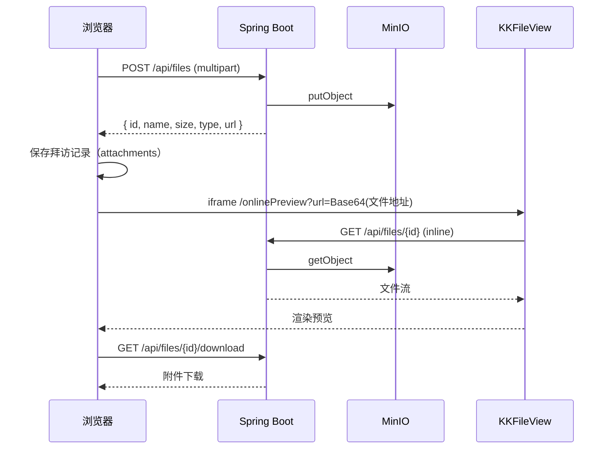

# MinIO + Spring Boot + KKFileView 文件预览与下载接入指南

> 适用场景：拜访管理等模块的附件上传后需要在线预览（Word / Excel / PPT / PDF / 图片 / 文本等常见格式）与下载。
> 本仓库前端已完成 KKFileView 预览接入（`src/utils/preview.ts` + 拜访管理预览弹窗），
> 本文档说明后端如何用 MinIO 存储文件、用 Spring Boot 提供上传/下载接口，并与 KKFileView 配合完成预览。

## 1. 整体架构



职责划分：

| 组件 | 职责 |
| ---- | ---- |
| MinIO | 文件对象存储（bucket + objectName），私有桶 |
| Spring Boot | 上传接口（鉴权后写入 MinIO + 附件表）、下载接口（流式返回）、预览地址生成 |
| KKFileView | 把 Office/PDF 等转成可预览内容，前端用 iframe 嵌入 |
| 前端 | 上传组件、附件列表、预览弹窗（iframe 指向 KKFileView）、下载按钮 |

## 2. MinIO 搭建

使用 Docker 单机部署（示例）：

```bash
docker run -d --name minio \
  -p 9000:9000 -p 9001:9001 \
  -e "MINIO_ROOT_USER=minioadmin" \
  -e "MINIO_ROOT_PASSWORD=minioadmin123" \
  -v D:/minio/data:/data \
  minio/minio server /data --console-address ":9001"
```

- `9000`：S3 API 端口（Java SDK 连接用）
- `9001`：管理控制台（浏览器访问 `http://localhost:9001`）
- 首次登录后在控制台创建 Bucket（如 `rental-files`），并创建 Access Key / Secret Key
- 建议 Bucket 权限设为 **Private**，文件访问一律走后端接口或预签名 URL，不要把 MinIO 9000 端口暴露到公网

## 3. Spring Boot 集成

### 3.1 依赖

```xml
<dependency>
    <groupId>io.minio</groupId>
    <artifactId>minio</artifactId>
    <version>8.5.12</version>
</dependency>
```

### 3.2 配置

```yaml
spring:
  servlet:
    multipart:
      max-file-size: 50MB
      max-request-size: 200MB

minio:
  endpoint: http://localhost:9000
  access-key: minioadmin
  secret-key: minioadmin123
  bucket: rental-files
```

> 注意：KKFileView 在容器/Docker 中运行，它拉取文件用的地址必须是**它能访问到的地址**。
> 如果后端和浏览器都在本机，KKFileView 也是本机 Docker 起的，`localhost` 指向容器自身，
> 此时应把下载接口地址拼成宿主机 IP（如 `http://192.168.x.x:8080/api/files/123`），
> 或让后端返回的 `url` 直接是 MinIO 预签名地址（见 3.6）。

### 3.3 MinioClient Bean

```java
@Configuration
public class MinioConfig {

    @Bean
    public MinioClient minioClient(@Value("${minio.endpoint}") String endpoint,
                                   @Value("${minio.access-key}") String accessKey,
                                   @Value("${minio.secret-key}") String secretKey) {
        return MinioClient.builder()
                .endpoint(endpoint)
                .credentials(accessKey, secretKey)
                .build();
    }
}
```

### 3.4 上传接口（后端鉴权后存储）

```java
@PostMapping("/api/files")
public Attachment upload(@RequestParam("file") MultipartFile file) throws Exception {
    // 1. 生成对象名：按日期/业务分组，避免重名
    String objectName = "visit/" + LocalDate.now() + "/" + UUID.randomUUID() + "-" + file.getOriginalFilename();

    // 2. 写入 MinIO
    minioClient.putObject(PutObjectArgs.builder()
            .bucket(bucket)
            .object(objectName)
            .stream(file.getInputStream(), file.getSize(), -1)
            .contentType(file.getContentType())
            .build());

    // 3. 保存附件记录（附件表：id、name、size、type、objectName、bucket、业务关联 id、创建人等）
    FileRecord record = fileRecordMapper.save(FileRecord.builder()
            .name(file.getOriginalFilename())
            .size(file.getSize())
            .type(file.getContentType())
            .objectName(objectName)
            .build());

    // 4. 返回给前端（url 为后端下载接口地址，预览与下载都走它）
    return new Attachment(record.getId(), record.getName(), record.getSize(), record.getType(),
            "/api/files/" + record.getId());
}
```

前端契约与仓库中 `Attachment` 类型一致：`{ id, name, size, type, url }`。

### 3.5 下载接口（预览用 inline / 下载用 attachment）

```java
@GetMapping("/api/files/{id}")
public void preview(@PathVariable Long id, HttpServletResponse response) throws Exception {
    FileRecord record = fileRecordMapper.findById(id);
    // Content-Disposition 用 inline，KKFileView 才能直接拉取内容
    response.setHeader("Content-Disposition", "inline; filename=\"" + record.getName() + "\"");
    streamFile(record, response);
}

@GetMapping("/api/files/{id}/download")
public void download(@PathVariable Long id, HttpServletResponse response) throws Exception {
    FileRecord record = fileRecordMapper.findById(id);
    response.setHeader("Content-Disposition",
            "attachment; filename=\"" + URLEncoder.encode(record.getName(), StandardCharsets.UTF_8) + "\"");
    streamFile(record, response);
}

private void streamFile(FileRecord record, HttpServletResponse response) throws Exception {
    response.setContentType(record.getType());
    response.setContentLengthLong(record.getSize());
    try (InputStream in = minioClient.getObject(GetObjectArgs.builder()
            .bucket(bucket)
            .object(record.getObjectName())
            .build())) {
        in.transferTo(response.getOutputStream());
    }
}
```

> 如果前端需要直链下载，也可以生成 MinIO 预签名 URL 返回给前端，浏览器直接下载。

### 3.6 预签名 URL（替代后端代理下载时使用）

```java
String presignedUrl = minioClient.getPresignedObjectUrl(
        GetPresignedObjectUrlArgs.builder()
                .method(Method.GET)
                .bucket(bucket)
                .object(objectName)
                .expiry(60 * 10) // 10 分钟
                .build());
```

预签名 URL 可直接作为附件的 `url` 返回，KKFileView 也能拉取；缺点是地址有时效，附件列表缓存后可能过期，推荐以内网后端下载接口为主、预签名用于下载兜底。

### 3.7 鉴权建议

- Bucket 保持私有；上传接口需要登录态（当前系统已有 JWT 拦截器，复用即可）
- 预览链路：KKFileView 拉取文件时**没有用户 Token**，两种常见做法：
  1. **内网放行**：`/api/files/{id}` 仅内网可访问（网关白名单或只允许内网 IP），浏览器与 KKFileView 都在内网；
  2. **短时效预签名 URL**：后端返回附件时生成 10 分钟有效的 MinIO 预签名地址，KKFileView 拉取后即完成预览
- 下载接口：建议保留登录鉴权，前端下载走带 Token 的请求

## 4. KKFileView 搭建

```bash
docker run -d --name kkfileview -p 8012:8012 keking/kkfileview:latest
```

- 访问 `http://localhost:8012/index` 验证服务是否正常
- 支持格式：doc/docx/xls/xlsx/ppt/pptx/pdf、图片、txt 等 30+ 种
- Office 转 PDF 依赖内置 LibreOffice，首次预览较慢属正常
- 中文乱码时：将 Windows 中文字体（如 `simsun.ttc`、`msyh.ttc`）挂载进容器，或安装 `wqy-zenhei` 等字体后重启

### 4.1 预览地址规则

```
http://<kkfileview-host>:8012/onlinePreview?url=<encodeURIComponent(Base64(文件HTTP地址))>
```

即：把文件可访问的 HTTP(S) 地址先做 UTF-8 Base64，再 URL 编码后作为 `url` 参数。

前端已封装好（`src/utils/preview.ts`）：

```ts
import { buildKKFileViewPreviewUrl } from '@/utils/preview'

const previewUrl = buildKKFileViewPreviewUrl('/api/files/123') // 需是 KKFileView 可达的完整地址
```

## 5. 前端接入现状（本仓库）

1. 环境变量：
   - `.env.development`：`VITE_KKFILEVIEW_URL=http://localhost:8012`
   - `.env.production`：按部署环境填写 KKFileView 服务地址
2. 拜访管理附件预览弹窗逻辑：
   - 附件 `url` 为 **HTTP(S) 地址** 且已配置 `VITE_KKFILEVIEW_URL` → iframe 加载 KKFileView 预览
   - 否则回退浏览器内置预览（图片/PDF/文本）或“下载”兜底
3. 上传：当前 Mock 模式把文件转成 Data URL 存储；接入真实后端后，将 `fileToDataUrl` 替换为
   `multipart/form-data` 上传，后端按 3.4 返回 `{ id, name, size, type, url }` 即可
4. 下载：预览弹窗“下载”按钮直接使用附件 `url`（后端下载接口带 `Content-Disposition: attachment` 时即触发下载）

## 6. 完整时序



## 7. 常见问题排查

| 现象 | 原因/处理 |
| ---- | ---- |
| KKFileView 页面提示无法获取文件 | 文件地址不是 KKFileView 可达的地址（`localhost` 指向容器自身）；改用宿主机 IP 或预签名 URL |
| Office 预览乱码 | 容器缺少中文字体，安装 `wqy-zenhei` 或挂载 Windows 字体后重启容器 |
| 上传大文件被拒 | 调大 `spring.servlet.multipart.max-file-size` 与网关/Nginx 的请求体限制 |
| 预览接口跨域 | 后端下载接口与前端/KKFileView 不同域时配置 CORS，或由 Nginx 反代同域 |
| 预签名 URL 过期 | 附件列表缓存时间超过有效期；改用后端下载接口或延长有效期 |
| 安全 | Bucket 保持私有；MinIO 9000 不暴露公网；下载接口保留登录鉴权 |

## 8. 相关代码位置

- 前端预览工具：[src/utils/preview.ts](../src/utils/preview.ts)
- 前端预览弹窗：[src/views/market/visit/index.vue](../src/views/market/visit/index.vue)
- 附件类型定义：[src/types/index.ts](../src/types/index.ts)（`VisitAttachment` / `Attachment`）
