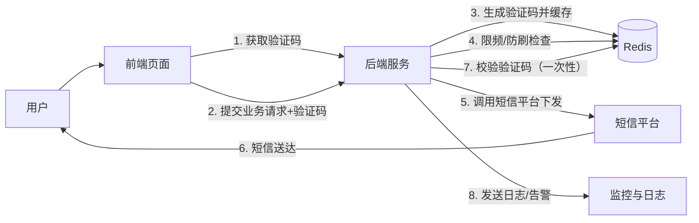
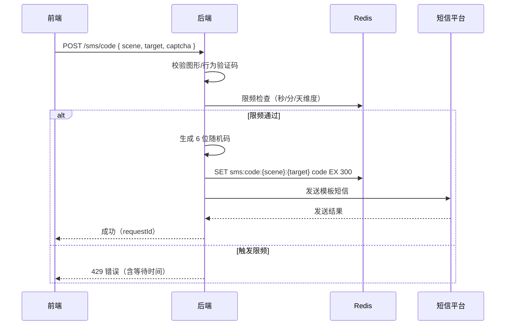
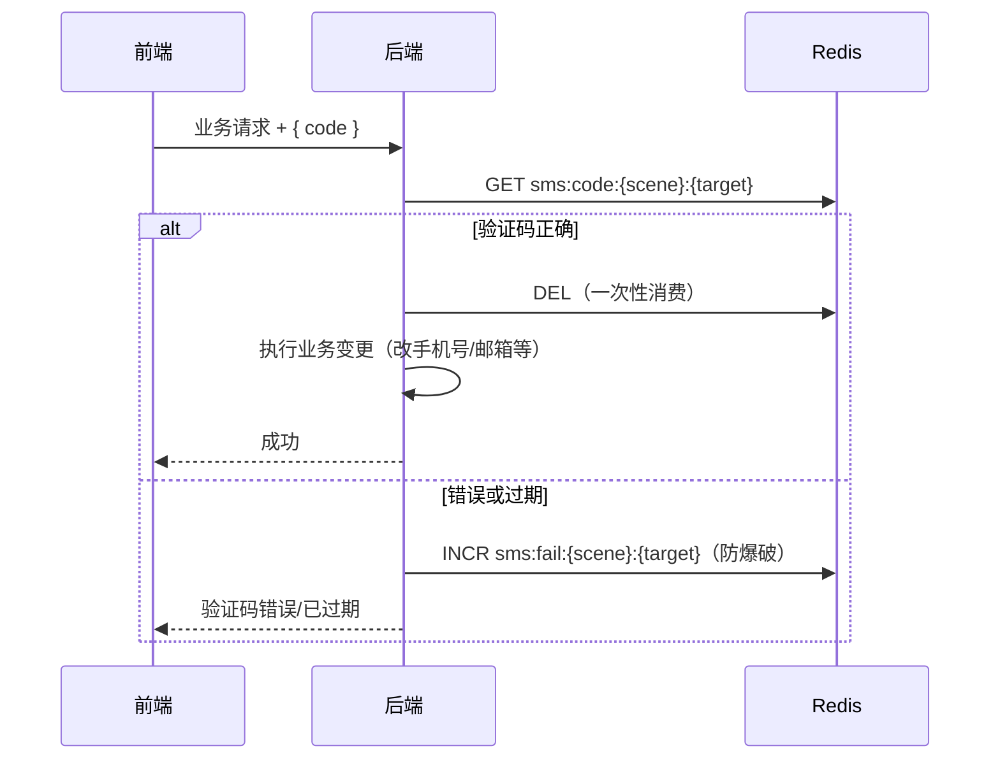

# 短信验证码技术方案设计

> 适用场景：登录/注册、找回账户、个人中心改绑手机号/邮箱等需要"手机/邮箱验证码校验"的业务。
> 当前项目为 Mock 演示阶段（验证码固定 `123456`），本文给出接入真实后端时的目标架构与落地路径。

## 1. 总体结论（速览）

| 组件 | 是否需要 | 说明 |
| ---- | ---- | ---- |
| Redis | ✅ 需要 | 存验证码（TTL 过期）、限频、防爆破 |
| 短信平台（阿里云/腾讯云等） | ✅ 需要 | 真正下发短信 |
| Kafka | ❌ 现阶段不需要 | 验证码是低频按需请求，MQ 级别用不到；详见第 8 节 |
| 消息队列（Redis Stream / RabbitMQ） | ⚠️ 可选 | 量上来或要解耦发送与业务时再引入 |
| 图形验证码 / 行为验证 | ✅ 建议 | 防脚本刷短信，控制成本 |
| 语音验证码（兜底） | ⚠️ 可选 | 短信到达异常时的人工兜底通道 |

## 2. 总体架构



组件职责：

- **前端**：图形验证码/行为验证 → 触发短信；提交业务参数 + 短信验证码；发送失败/限频的错误提示。
- **后端**：验证码生成、Redis 读写、限频、调用短信 SDK、校验与消费验证码、日志与告警。
- **Redis**：验证码存储、限频计数器、防爆破计数。
- **短信平台**：真实通道下发；生产建议主备双通道。

## 3. 核心流程

### 3.1 发送验证码



### 3.2 校验验证码



## 4. Redis 设计

### 4.1 Key 设计

| Key | 类型 | TTL | 说明 |
| ---- | ---- | ---- | ---- |
| `sms:code:{scene}:{target}` | string | 300s | 验证码本体，校验后删除（一次性） |
| `sms:code:{scene}:{target}:retry` | string | 60s | 发送间隔（如 60s 内不可重发） |
| `sms:limit:{scene}:{target}:min` | counter | 60s | 每分钟发送上限 |
| `sms:limit:{scene}:{target}:hour` | counter | 3600s | 每小时发送上限 |
| `sms:limit:{scene}:{target}:day` | counter | 86400s | 每天发送上限 |
| `sms:fail:{scene}:{target}` | counter | 900s | 校验失败次数，超过阈值锁定 |
| `captcha:{sessionId}` | string | 300s | 图形/行为验证码（发短信前先过） |

### 4.2 限频策略（示例）

- 同一手机号：60 秒内 1 条、1 小时内 3 条、1 天内 5 条（按场景可配置）
- 同一 IP：1 小时内 10 条
- 校验失败：连续 5 次错误锁定 15 分钟
- 建议用 Redis Lua 脚本保证"检查 + 自增"原子性，防止并发绕过

## 5. 防刷与安全

1. **图形验证码 / 行为验证**（极验、网易易盾等）在发短信前拦截，防脚本批量刷
2. **短信内容合规**：模板需企业实名 + 签名审核（如 `【XX租赁】`），变量只能用于验证码等白名单字段
3. **校验码不落日志**：打码（`******`），防止日志泄露
4. **一次性消费**：校验通过立即删除，防止重放
5. **场景隔离**：`scene` 区分 login/register/forgot/changePhone/changeEmail，避免跨场景复用
6. **成本控制**：限频 + 防刷 + 实时告警（日发送量、失败率、到达率）

## 6. 短信平台选型

| 平台 | 稳定性 | 价格（约） | 特点 |
| ---- | ---- | ---- | ---- |
| 阿里云短信 | 高 | ~0.045 元/条 | 国内使用最广，生态完善，工单/合规有保障 |
| 腾讯云短信 | 高 | ~0.04 元/条 | 量大优惠明显，与微信生态结合好 |
| 华为云短信 | 高 | ~0.045 元/条 | 政企客户多 |
| 移动云 / 天翼云 | 高 | 中等 | 运营商自有通道，到达率有保障 |
| 云片（Yunpian） | 中 | ~0.035 元/条 | 接入简单、价格灵活，适合预算敏感 |
| 容联云 / Submail / 互亿无线 | 中 | 低至 0.03 元/条 | 价格最低档，需实测到达率 |

**建议**：

- 主通道：阿里云或腾讯云（有云账号、发票、合规的前提下）
- 备用通道：第三方平台（云片等）做双通道冗余，主通道异常自动切换
- 验证码是高可用场景，**不要单通道**；审核、封禁、通道拥堵都会导致用户收不到码

## 7. 是否需要 Kafka / 消息队列

### 7.1 结论

**验证码场景现阶段不需要 Kafka**。原因：

- 验证码是"按需、低频、低吞吐"请求：一次登录/注册/改绑触发一条，单机 QPS 通常只有几十到几百
- Kafka 的成本高：部署运维、分区与消费组、消息语义、监控告警，复杂度远大于收益
- 即便要异步化，也有更轻的中间层

### 7.2 异步化方案对比

| 方案 | 复杂度 | 适用场景 |
| ---- | ---- | ---- |
| 同步直发 + 失败重试 | 最低 | 量小、接受秒级延迟，MVP 首选 |
| 线程池异步发送 | 低 | 想立即返回、不阻塞请求时 |
| Redis Stream（复用 Redis） | 中 | 需要削峰/重试/简单队列，不想引入新组件 |
| RabbitMQ | 中 | 公司已有 MQ 基础设施，或后续有更多异步业务 |
| Kafka | 高 | **大批量营销短信群发、事件驱动架构、审计/日志流**时才值得 |

### 7.3 什么情况才需要 Kafka

- 营销短信批量群发（一次几十万条）
- 订单/支付等事件驱动链路（发短信只是其中一个消费者）
- 需要消息回溯、多消费者、流式处理（如实时风控、数据同步）

如果未来出现这些场景，再引入 Kafka 不迟；验证码通道保持独立轻量。

## 8. 其他可替代 / 补充方案

1. **验证码存储替代**：Redis（推荐）> 数据库表 + 定时清理 > 内存 Map（单机、重启丢失）
2. **验证码托管服务**：Twilio Verify、阿里云号码认证等"验证码即服务"，生成与校验都由厂商托管，减少自研；国内主流仍是自研 Redis + 短信平台
3. **语音验证码兜底**：短信到达异常时，自动转语音播报验证码
4. **邮件验证码**：低频场景（改邮箱、找回密码）可走邮件通道，成本更低
5. **微信模板消息 / 小程序订阅消息**：如业务在微信生态内，可作补充通道
6. **行为验证替代图形验证码**：滑块、点选等体验更好，防刷能力更强

## 9. 高可用与降级

- **双通道短信**：主通道失败自动切换备用通道，失败记录 + 告警
- **发送失败重试**：有限次数重试（如 3 次），避免雪崩；重试上限内仍失败则转语音/邮件兜底
- **Redis 不可用**：降级为本地缓存 + 日志告警（验证码仍可短暂工作），或直接熔断发送
- **监控告警**：到达率、失败率、发送延迟、限频命中率、日发送量；异常即告警
- **审计**：发送记录（requestId、scene、target、渠道、结果、IP）入库，便于排查与合规

## 10. 接口契约（后端就绪后对齐）

当前 Mock 已按以下形状预留，前端无需改动即可切换：

```text
POST /sms/code
  请求: { scene: 'login'|'register'|'forgot'|'changePhone'|'changeEmail', target: '手机号或邮箱', captcha?: '图形验证码' }
  响应: { code: 200, data: { requestId: 'xxx' }, message: 'success' }

业务接口内校验验证码（示例）：
POST /auth/profile/update
  请求: { name?, avatar?, phone?, email?, code?, phoneCode?, emailCode? }
  说明: 改手机号需 phoneCode，改邮箱需 emailCode，均正确才生效（一次性）
```

错误码建议：

| 场景 | 错误码/提示 |
| ---- | ---- |
| 限频 | 429 或业务码 + 等待时间 |
| 验证码错误 | `auth.verifyCodeError` |
| 验证码过期 | `auth.codeExpired` |
| 校验失败次数超限 | `auth.codeLocked` |
| 通道异常 | 降级提示 + 服务端告警 |

## 11. 与现有项目的关系

- 当前是 Mock（验证码固定 `123456`），前端流程已按"发送 → 输入 → 校验"设计
- 接真实后端时：前端不变，Mock 适配器替换为真实接口；错误提示已按 i18n key 设计，切后端不会出现硬编码文案
- 个人中心"改手机号/邮箱"已支持按渠道分别校验，与本文的 `phoneCode` / `emailCode` 契约一致

## 12. 演进路线

```text
阶段一（MVP / 现在）：
  Mock 验证码 → 验证流程、前端联调

阶段二（接真实后端）：
  后端 + Redis（验证码/限频）→ 接入阿里云或腾讯云短信主通道 → 图形验证码防刷

阶段三（规模化）：
  双通道冗余 + 自动切换 → Redis Stream/RabbitMQ 异步发送 → 语音验证码兜底 → 全链路监控告警

阶段四（仅当出现事件驱动/海量营销场景）：
  评估引入 Kafka，作为事件总线承载营销群发、订单事件等
```
